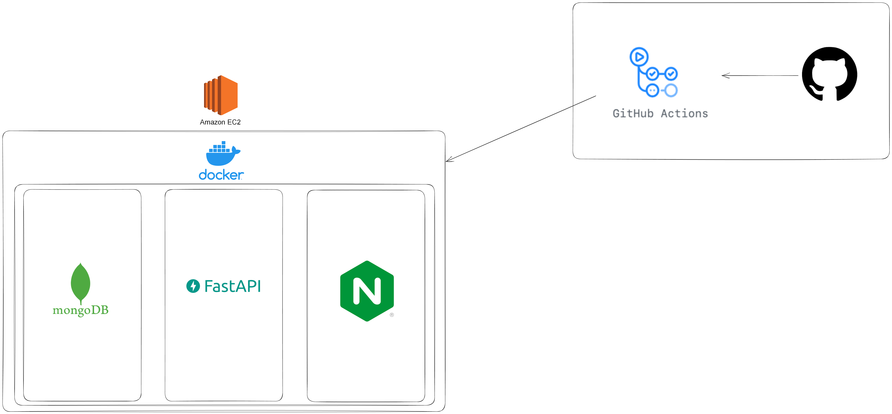
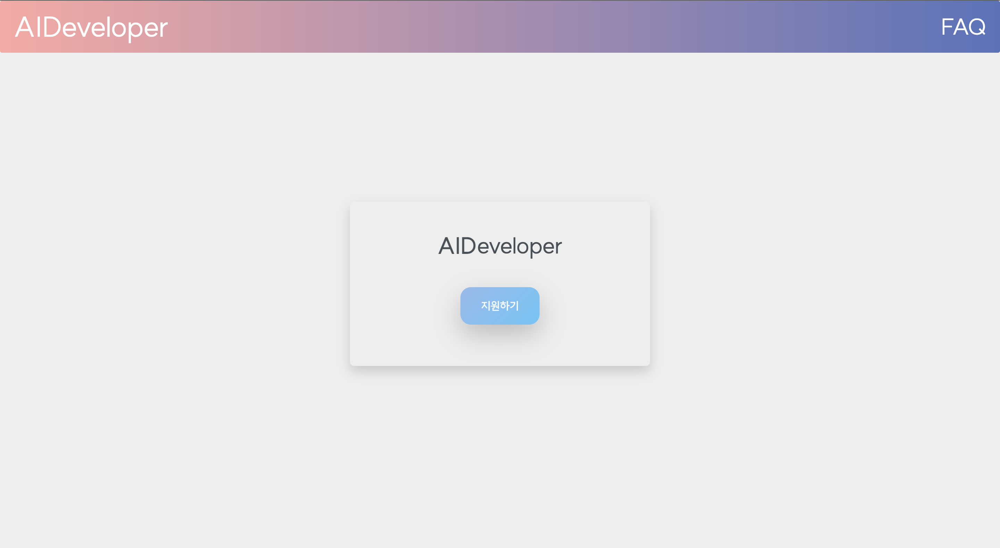
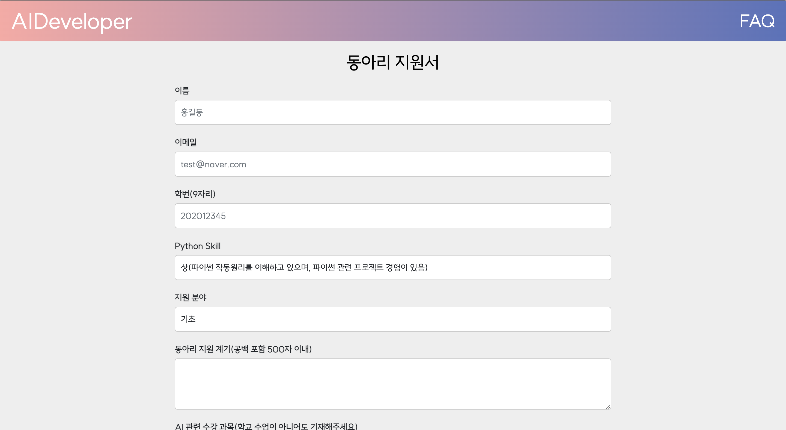
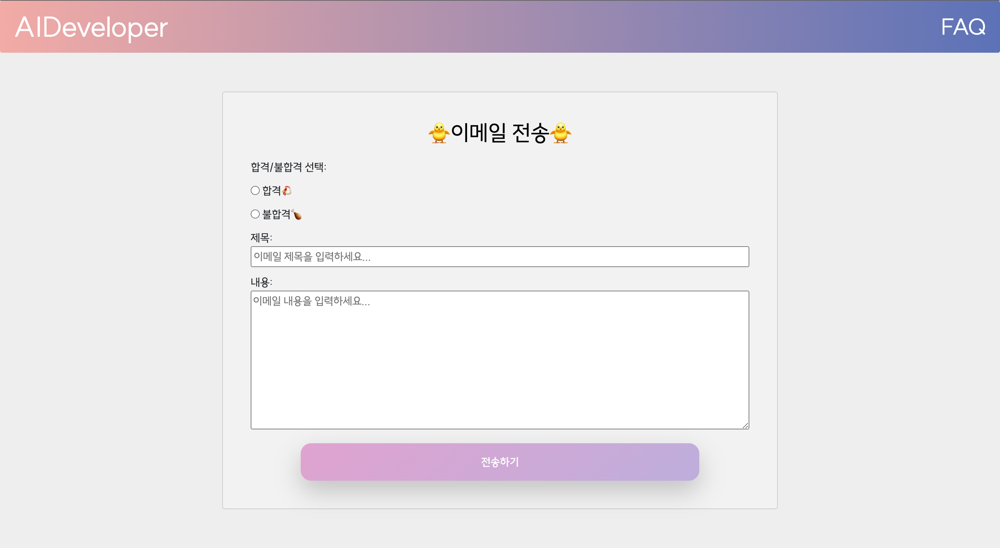
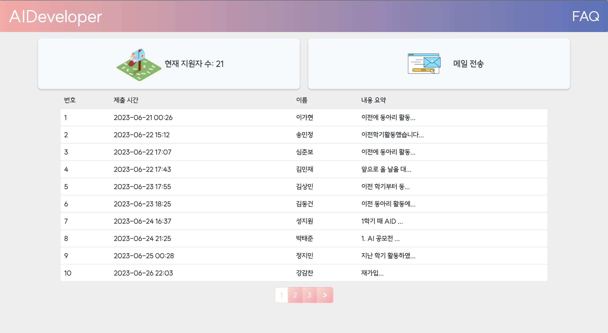
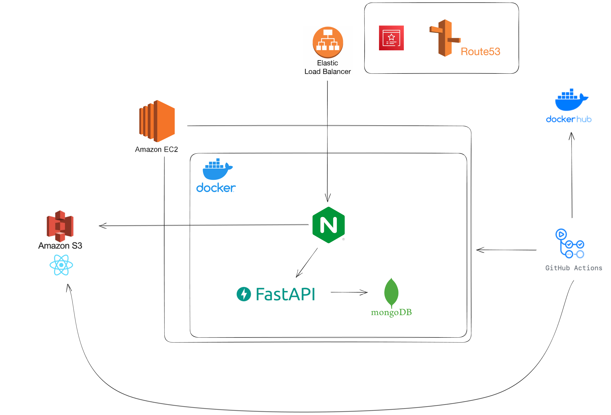

# 시스템 개요

## v0


## 화면
<p align=center>
    
    
</p>
<p align=center>
    
    
</p>


## v1


---

# Test 방법

```sh
# 파일 생성
backend/env/.server.env
    mongo_user=admin_user
    mongo_password=password
    mongo_host=db
    mongo_port=27017
    SECRET_KEY=***
    REFRESH_SECRET_KEY=***
    email_id=***
    email_pw=***(앱 비밀번호)

backend/env/.db.env
    MONGO_INITDB_ROOT_USERNAME=admin_user
    MONGO_INITDB_ROOT_PASSWORD=password


docker compose up -d
```
