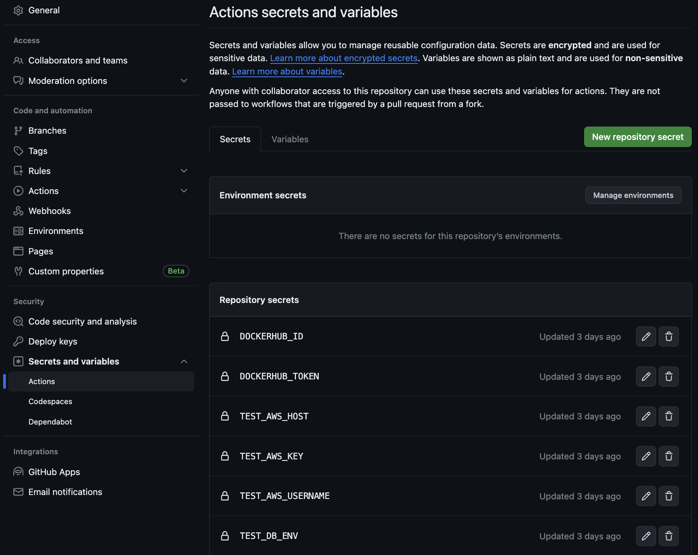

# Test Server

## requirements files

### docker-compose.test.yaml
- docker compose를 사용해, nginx 서버, FastAPI, MongoDB 서버 각각의 container를 deploy할 수 있도록 해주는 파일
- nginx container의 .conf 파일은 local의 `nginx.test.conf`파일을 container 내의 `/etc/nginx/nginx.conf`로 복사
FastAPI서버는 uvicorn으로 실행, 8000 port 사용. 환경 변수 파일은 `./env/.test_server.env`사용
MongoDB container는 30017 port를 통해 접속 가능하도록 설정, 환경 변수 파일은 `./env/.test_db.env`사용
### Dockerfile.test
FastAPI용 이미지 생성을 위한 Dockerfile. poetry 설치 후, pyproject.toml 내의 패키지 설치
Fastapi 서버 이미지 생성을 위한 도커 파일
### config/nginx.test.conf
Test server용 nginx config 파일
80번 port(HTTP)로 접속 후,
* `/`로 접속 시, frontend 페이지로 forward pass
* `/api`로 접속 시, fastapi backend로 forward pass
### config/deploy_test.sh
docker container 모두 내린 후 기존 fastapi 서버 이미지 삭제, 이 후 docker hub에 새로 push한 이미지를 가져와서 docker compose up 실행 (완벽한 CD가 아님, 추후 수정 필요)
### .github/test.yaml
- test 브랜치에 PR시 실행
- env 파일 생성 후 env, nginx.conf, deploy_test.sh파일을 scp를 통해 AWS VM에 전달
- docker setup
- docker hub login
- 만들어진 도커 파일 push
- ssh로 VM에 접근하여 deploy_test.sh 실행

## AWS EC2

### EC2 빌리기
- 가능하면 아시아 지역 서버 빌릴 것
- 테스트 서버이기 때문에 컴퓨팅 자원 작아도 상관없음
- key는 절대 유포하지 않아야 함(웬만하면 한 사람이 관리할 것)
- 빌린 서버에 접속해서 docker 설치필요

### 탄력적 IP 조정
고정 ip 사용해서 ngginx의 server_name에 넣어야 함

### 보안규칙
HTTP 80 허용해야함
악의적인 접근을 시도하는 경우가 종종 있어 모든 ip 접근은 최대한 하지 않고 본인이 자주 접속하는 ip를 지정해서 보안규칙에 추가할 것,

DB port도 마찬가지임

### Github Secret Variable
아래 참고해서 사용

※ fork한 repo에서 PR시 github secret변수를 사용하지 못하는 문제가 있음.
dev branch에 먼저 PR한 후 origin repo에서 test로 PR할 때 test server deploy

---
# Deploy Server
